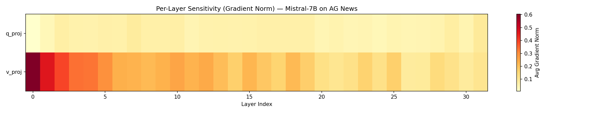
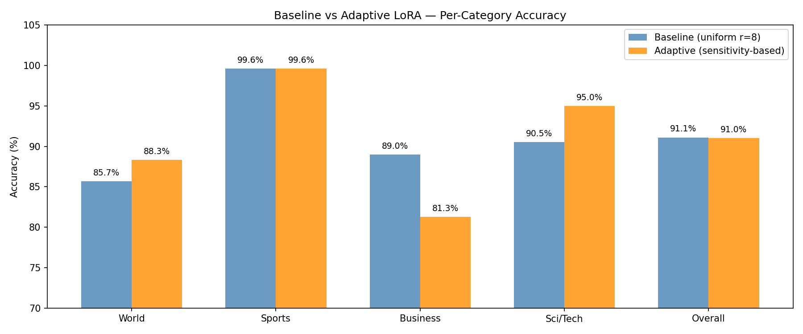
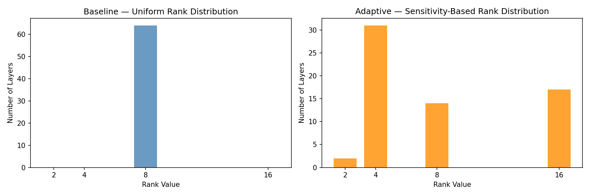

# NOUS — v1.0
## Sensitivity-Based LoRA Rank Allocation


> *Standard LoRA gives every transformer layer the same rank. Not all layers are equally important for a given task. This project asks: can gradient norms tell us which layers deserve more?*

---

## Background

### Transformers and Attention

A transformer processes text by passing token representations through a stack of layers. Each layer contains a self-attention mechanism that lets every token look at every other token in the sequence and decide what to pay attention to.

Inside each attention layer, three linear projections transform the input:

```
Q (query)  → what is this token looking for?
K (key)    → what does each token contain?
V (value)  → what information gets passed forward?
```

These are implemented as weight matrices — `q_proj`, `k_proj`, `v_proj` — and they are the primary site of task-specific adaptation during fine-tuning. When you teach a pretrained model a new task, these layers are where most of the learning happens.

This project targets `q_proj` and `v_proj` specifically — the two projections most responsible for directing attention and controlling information flow.

---

### Why LoRA

Fine-tuning all 7 billion parameters of Mistral-7B requires updating 7B gradients per step — roughly 112GB of memory for weights, gradients, and optimizer states combined. That is not accessible on consumer hardware.

LoRA (Low-Rank Adaptation) solves this by freezing all original weights and adding small trainable matrices alongside each targeted layer:

```
output = W×input + B×A×input

W = frozen pretrained weight (never changes)
B × A = small trainable update (the only thing trained)
```

The rank `r` controls the size of B and A. At rank 8, LoRA adds roughly 3.4M trainable parameters to Mistral-7B — 0.047% of the total. Everything else stays frozen.

The problem: standard LoRA assigns the same rank to every layer. Not all layers are equally important for a given task, but LoRA treats them as if they are.

---

## What This Project Does

A gradient-norm-based LoRA rank pre-allocation strategy. Instead of assigning identical rank to every layer (uniform LoRA) or continuously recomputing ranks during training via SVD (AdaLoRA), this method:

1. Runs a short 200-step warmup on the target task
2. Measures how strongly each layer responds via RMS-normalized gradient norms
3. Allocates rank proportionally — once, before training begins

Same total parameter budget as uniform LoRA. Smarter distribution.

---

## The Problem With AdaLoRA

AdaLoRA addresses non-uniform rank allocation by using SVD decomposition during training to dynamically prune singular values. It works, but:

```
SVD at every training step  → computationally expensive
Ranks change during training → unstable, hard to reproduce
Complex implementation      → difficult to extend or modify
```

This project asks a simpler question: is a one-time pre-allocation from a short warmup enough to capture meaningful sensitivity differences between layers?

---

## Approach

### Step 1 — Warmup (200 steps)
Run a short training warmup on the target task. After each step, measure gradient norms per LoRA layer using RMS normalization. Average across all 200 steps.

```python
# RMS-normalized gradient norm (size-independent)
sensitivity[name] += (param.grad.norm() / param.grad.numel() ** 0.5).item()
```

### Step 2 — Rank Allocation (CPU, seconds)
Allocate ranks proportionally to sensitivity scores within a fixed total budget. Ranks rounded to powers of 2, clamped to [2, 16]. Budget identical to uniform baseline (64 × r=8 = 512 rank units).

### Step 3 — Train (fixed ranks, one full run)
Train with pre-allocated ranks. No recomputation during training. Compare against uniform LoRA baseline (r=8 everywhere) and random rank allocation (ablation).

### Step 4 — Evaluate
Per-category accuracy on AG News test set. Confusion matrix analysis.

---

## Key Findings

### Finding 1 — v_proj is consistently more sensitive than q_proj

Across all 32 layers of Mistral-7B, value projection layers showed significantly higher gradient norms than query projection layers during task-specific warmup on AG News.



**Why:** `v_proj` controls what information flows forward through the network. Fine-tuning on a new task requires recalibrating content extraction. `q_proj` attention routing patterns from pretraining transfer more readily to new tasks with minimal adjustment.

---

### Finding 2 — GQA introduces a tensor-size bias in raw gradient norms

In Mistral-7B's grouped query attention (32 Q heads, 8 KV heads), `q_proj` has 4× more parameters than `v_proj`. Raw L2 gradient norm scales with tensor size — a larger tensor produces a larger norm even at identical per-element gradient magnitude.

Without normalization, the allocator reads this size difference as an importance difference and concentrates the entire rank budget into `q_proj`, starving `v_proj` entirely. This produced 35.5% accuracy.

The fix — RMS normalization:

```python
# broken — raw L2, biased by tensor size
sensitivity[name] += param.grad.norm().item()

# fixed — RMS, size-independent
sensitivity[name] += (param.grad.norm() / param.grad.numel() ** 0.5).item()
```

This single change moved accuracy from 35.5% to 91.0%.

---

### Finding 3 — Rank redistribution shifts category-level performance

| Method | Overall | World | Sports | Business | Sci/Tech |
|--------|---------|-------|--------|----------|----------|
| Baseline (uniform r=8) | 91.10% | 85.7% | 99.6% | 89.0% | 90.5% |
| Adaptive (ours) | 91.00% | 88.3% | 99.6% | 81.3% | 95.0% |
| Random (ablation) | pending | - | - | - | - |



Adaptive allocation achieved comparable overall accuracy while meaningfully redistributing performance. Sci/Tech improved +4.5%, World +2.6%. Business dropped -7.7%.

Sci/Tech and Business share significant vocabulary — Apple, Google, product, market, earnings. Rank redistribution sharpened the model's ability to distinguish these semantically overlapping categories, improving one at the cost of the other. The decision boundary shifted; it did not uniformly improve.



---

### Finding 4 — Pre-allocation is simpler and more predictable than AdaLoRA

One warmup run. Ranks fixed before training. No SVD during training. No dynamic recomputation. Fully reproducible rank assignments stored in a plain JSON file before the main training run starts. Warmup overhead: ~4.8% of total training time.

---

## Limitations

**Constrained compute budget.** All experiments ran on free-tier T4/P100 GPUs (Colab and Kaggle). Training used 8,000 of 120,000 available AG News examples across 2 epochs. Results may differ with more data or longer training.

**Single dataset and model.** Findings are specific to Mistral-7B on AG News. The v_proj sensitivity pattern may not generalize to all architectures or tasks. Phi-2 experiments suggest it does hold across models with standard MHA, but broader validation is needed.

**Evaluation on a subset.** Final evaluation used 1,000 of 7,600 test examples. Accuracy estimates carry some variance at this sample size.

**Business/Sci/Tech tradeoff unresolved.** The -7.7% Business drop is explainable but not fixed in this version. Separate per-projection budgets or category-aware allocation are proposed as future directions but not implemented here.

---

## A Note on the Findings

These results come from a single experimental setup — one model, one dataset, one training run per method. The findings are real and reproducible within this setup, but should be interpreted as preliminary evidence rather than definitive conclusions.

The most robust finding is Finding 2 — the GQA tensor-size bias and its fix. This is a concrete, reproducible implementation insight that applies to anyone running sensitivity analysis on grouped query attention models.

Finding 1 (v_proj > q_proj sensitivity) is consistent across both models tested and has a clear theoretical motivation, but would benefit from validation on more architectures and tasks.

Finding 3 (category boundary shift) is the most task-specific finding. Whether adaptive rank allocation consistently helps or hurts specific categories on other tasks is an open question.

---

## How To Run

### Setup
```bash
git clone https://github.com/Arham-Mod/nous
cd nous
pip install -r requirements.txt
```

### Step 1 — Measure Layer Sensitivity
*Requires GPU. Run on Colab or Kaggle.*
```bash
python src/sensitivity.py --config configs/adaptive_lora.yaml
```
Output: `results/sensitivity_aggregated.json`

### Step 2 — Allocate Ranks
*Runs locally, no GPU needed.*
```bash
python src/allocate.py --input results/sensitivity_aggregated.json \
                        --output results/rank_allocation.json
```
Output: `results/rank_allocation.json`

### Step 3 — Train
*Requires GPU. Run on Colab or Kaggle.*
```bash
# baseline
python src/train.py --config configs/baseline_lora.yaml

# adaptive (requires rank_allocation.json from step 2)
python src/train.py --config configs/adaptive_lora.yaml

# random ablation
python src/train.py --config configs/random_lora.yaml
```

### Step 4 — Evaluate
*Requires GPU.*
```bash
python src/evaluate.py --config configs/baseline_lora.yaml
python src/evaluate.py --config configs/adaptive_lora.yaml
python src/evaluate.py --config configs/random_lora.yaml
```
Output: `results/tables/{experiment_name}_results.json`

### Step 5 — Plot Results
*Runs locally, no GPU needed.*
```bash
python src/plot_results.py
```
Output: `results/figures/`

---

## Project Structure

```
nous/
├── src/
│   ├── sensitivity.py           # gradient norm measurement (RMS-normalized)
│   ├── aggregate.py             # pool lora_A + lora_B per layer-projection
│   ├── allocate.py              # convert scores to rank assignments
│   ├── train.py                 # training loop (all three experiments)
│   ├── evaluate.py              # evaluation + confusion matrix
│   ├── plot_results.py          # generate all result figures
│   └── utils.py                 # shared helpers
├── configs/
│   ├── baseline_lora.yaml       # uniform rank=8
│   ├── adaptive_lora.yaml       # sensitivity-based ranks
│   └── random_lora.yaml         # random ablation
├── results/
│   ├── sensitivity_scores.json        # raw per-parameter scores
│   ├── sensitivity_aggregated.json    # 64 layer-projection scores
│   ├── rank_allocation.json           # 64 rank assignments
│   ├── figures/                       # plots
│   └── tables/                        # accuracy results per experiment
├── notebooks/
│   ├── 01_Baseline_Training.ipynb
│   ├── 02_Sensitivity_Warmup.ipynb
│   ├── 03_Adaptive_Training.ipynb
│   └── 04_Evaluation.ipynb
├── requirements.txt
└── README.md
```

---

## Closing Note

This project started from a simple observation — standard LoRA wastes capacity by treating all layers equally — and followed that observation to see where it leads.

What it found: the sensitivity signal is real, the GQA bias is a genuine implementation trap that others will hit, and the category boundary shift is a concrete, explainable consequence of rank redistribution rather than a random failure.

What it did not find: uniform improvement across all metrics. That would have been a cleaner story. This is an honest one.

The code is structured to be extended — swap in a different model, a different dataset, a different sensitivity metric, or a different allocation strategy by changing a config file and a function. That was a deliberate choice.

---

*Model: Mistral-7B-v0.1 · Dataset: AG News · Hardware: T4/P100 (Colab/Kaggle free tier)*